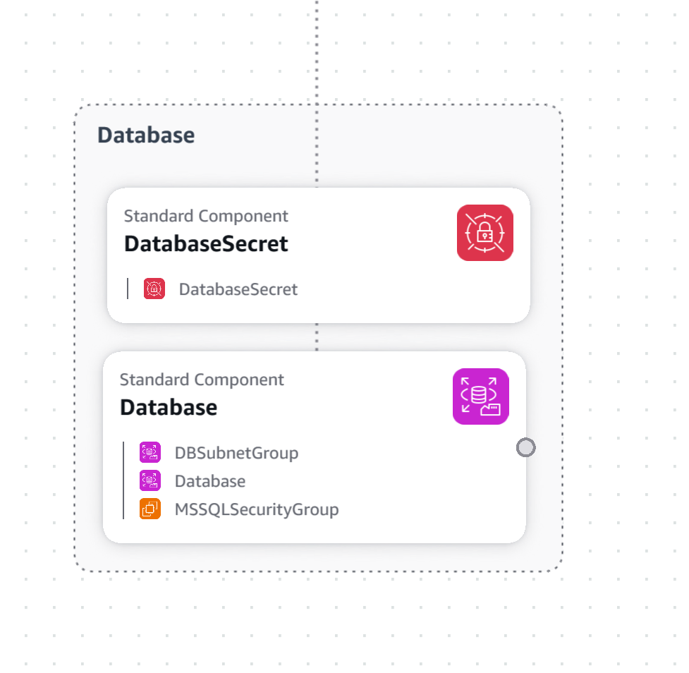

# Mechanics Database

Provisiona a infraestrutura de banco de dados usando Terraform.

## Definição do ambiente

Os bancos de dados podem ser [relacionais](./relational/README.md) ou [NoSQL](./no-sql/README.md).
Ambos utilizam credenciais geradas pelo Terraform e armazenadas no [AWS Secrets Manager](https://aws.amazon.com/pt/secrets-manager/).

### Relacional

- Banco de dados: MSSQL 2025
- Instância: RDS `db.t3.small`

### NoSQL

- Banco de dados: DynamoDB

## Instruções

Para criar uma nova instância, navegue até a pasta com o tipo de banco corresponde - [`relational`](./relational/README.md) ou [`no-sql`](./no-sql/README.md) - e crie uma subpasta com o nome do projeto em `kebab-case`.
Dentro da pasta, use a seguinte estrutura:

```plain
no-sql/
├── new-project/
│   ├── backend.tf
│   ├── main.tf
│   ├── vars.tf
│   └── README.md (opcional)
└── README.md
```

### `main.tf`

Importa o módulo corresponde e define alguns parâmetros.
Consulte a documentação de cada módulo para mais informações.

### `vars.tf`

O arquivo precisa obrigatoriamente declarar o ambiente, seguindo o modelo abaixo:

```terraform
variable "environment" {
  type    = string
  default = "dev"
}
```

### `backend.tf`

Defina para utilizar S3, mas sem definir o nome do bucket.
O bucket será definido pela pipeline ou script de inicialização.

```terraform
terraform {
  backend "s3" {
    region  = "us-east-1"
    encrypt = true

    use_lockfile = true
  }
}
```

## Provisionamento da infraestrutura

Para executar localmente, primeiro suba a camada `shared` disponível no [repositório de infraestrutura](https://github.com/FIAP-POS-TECH-13SOAT-MECHANICS/mechanics-infra).
Essa camada cria as configurações de rede necessárias para o ambiente.
Consulta a documentação do repositório para instruções de configuração e ferramentas necessárias.

Clone o repositório e execute o script de inicialização:

```powershell
git clone https://github.com/FIAP-POS-TECH-13SOAT-MECHANICS/mechanics-infra.git
cd mechanics-infra
./scripts/initialize-layer.ps1 shared
```

Após a conclusão, execute os comandos abaixo na raiz do repositório:

```powershell
$environment = "dev"
$bucketName = "fiap-mechanics-tf-$(aws sts get-access-key-info --access-key-id $(aws configure get aws_access_key_id) --query Account --output text)"

$dbType = "relational" # pode ser "relational" ou "no-sql"
$serviceName = "example-api" # nome do serviço que consumirá a instância

terraform -chdir="./$dbType/$serviceName" init -backend-config="bucket=$bucketName" -backend-config="key=$dbType-$serviceName-$environment.tfstate" -reconfigure
terraform -chdir="./$dbType/$serviceName" apply -var="environment=$environment"
```

Esse processo também está disponível via [scripts](./scripts/README.md):

```powershell
.\scripts\initialize-database.ps1 relational example-api dev
```

Ou utilize o script `invoke-terraform` para criar/destruir todos os recursos presentes no repositório:

```powershell
.\scripts\invoke-terraform.ps1 dev # -destroy
```

## Pipeline de CI/CD

Ao fazer alterações nas branches `main`, `release` ou `develop`, é disparada a pipeline [CI/CD](./.github/workflows/ci-cd.yml).

A pipeline executa os seguintes passos:

1. Identifica o nome do ambiente a partir da branch
   - `main` => `prod`
   - `release` => `stg`
   - `develop` => `dev`
2. Executa `terraform validate` para confirmar que o código está correto
3. Provisiona a camada `shared` do ambiente correspondente
4. Provisiona todos os bancos de dados definidos no repositório
   - Para `relational/sonarqube`, executa automaticamente o bootstrap SQL pós-provisionamento

> A implantação só é realizada se *todos* os scripts Terraform do repositório forem validados com sucesso.

## Diagramas

Todos as instâncias RDS (Microsoft SQL Server) possuem uma secret contendo a connectionString.



Já os bancos não-relacionais possuem apenas o próprio banco.
O acesso é feito através das credenciais da AWS.


